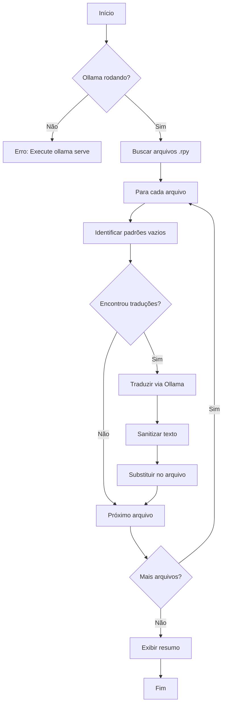

# 🌐 Auto Translator - Documentação

> **Ferramenta automatizada para tradução de arquivos Ren'Py utilizando IA local**

---

## 📋 Visão Geral

O `auto_translator.py` é uma ferramenta desenvolvida para automatizar o processo de tradução de Visual Novels criadas com o engine Ren'Py. O script utiliza o **Ollama** (um runtime de modelos de IA local) para realizar traduções de forma offline e gratuita, sem depender de APIs pagas ou conexão constante com serviços externos.

---

## 🔧 Ferramentas Necessárias

### 1. Python 3.8+
O script foi desenvolvido em Python e requer as seguintes bibliotecas:

```bash
pip install requests
```

### 2. Ollama
O **Ollama** é o motor de IA local que executa o modelo de linguagem. 

**Instalação:**
- Acesse: https://ollama.ai/
- Baixe e instale o Ollama para seu sistema operacional
- Após instalação, baixe o modelo de tradução:

```bash
ollama pull gemma3:4b
```

> **Nota:** O modelo `gemma3:4b` é utilizado por padrão por ser leve e eficiente, mas outros modelos como `llama3`, `mistral` ou `gemma2` também podem ser usados.

### 3. Ren'Py SDK
O Ren'Py SDK é necessário para gerar os arquivos base de tradução antes de usar o auto_translator. Baixe em: https://renpy.org/

---

## 🎮 Pré-requisito: Gerando Arquivos de Tradução no Ren'Py

> [!IMPORTANT]
> Antes de usar o `auto_translator.py`, você **DEVE** gerar os arquivos de tradução pelo Ren'Py Launcher. O script trabalha sobre esses arquivos gerados automaticamente.

### Passo a Passo no Ren'Py Launcher

1. **Abra o Ren'Py Launcher**
   - Execute o `renpy.exe` (Windows) ou `renpy.sh` (Linux/Mac)

2. **Selecione seu projeto**
   - Na lista de projetos à esquerda, clique no seu projeto

3. **Acesse "Generate Translations"**
   - No menu principal do projeto, clique em **"Generate Translations"**

4. **Defina o nome do idioma**
   - Digite o nome do idioma de destino (ex: `portuguese`, `spanish`, `japanese`)
   - Este nome será usado para criar a pasta de tradução

5. **Clique em "Generate Translations"**
   - O Ren'Py irá escanear **todos os arquivos .rpy** do seu projeto
   - Extrairá todos os textos traduzíveis (diálogos, narrações, strings de UI)
   - Criará a estrutura de arquivos em `game/tl/<idioma>/`

### O que o Ren'Py gera automaticamente

```
game/
└── tl/
    └── portuguese/              # Nome que você definiu
        ├── common.rpy           # Strings comuns do Ren'Py
        ├── screens.rpy          # Textos das telas e UI
        ├── options.rpy          # Opções e configurações
        └── scenes/              # Seus arquivos de cena
            ├── scene_1_*.rpy    # Espelha a estrutura original
            ├── scene_2_*.rpy
            └── ...
```

### Estrutura dos Arquivos Gerados

Os arquivos contêm os textos originais comentados e espaços vazios para tradução:

```python
# game/tl/portuguese/scenes/scene_1_michael_office.rpy

translate portuguese scene_1_michael_office_abc123:

    # michael "Good morning, everyone."
    michael ""

translate portuguese scene_1_michael_office_def456:

    # "The room falls silent as he enters."
    ""
```

> [!TIP]
> Execute "Generate Translations" novamente sempre que adicionar novos diálogos ao jogo. O Ren'Py atualizará os arquivos existentes sem sobrescrever traduções já feitas.

---

## 📁 Estrutura de Arquivos de Tradução

O Ren'Py gera automaticamente a estrutura de tradução em:

```
game/
└── tl/
    └── portuguese/          # Idioma de destino
        ├── common.rpy       # Textos de interface comuns
        ├── screens.rpy      # Textos das telas (UI)
        └── scenes/          # Diálogos das cenas
            ├── scene_1_*.rpy
            ├── scene_2_*.rpy
            └── ...
```

---

## 🔄 O Processo de Tradução

### Passo 1: Geração dos Arquivos Base

Primeiro, o Ren'Py gera os arquivos de tradução com as strings vazias:

```python
# Formato old/new (comum em common.rpy e screens.rpy)
translate portuguese strings:
    old "Start Game"
    new ""

# Formato de diálogo (comum em cenas)
translate portuguese scene_1_hash:
    # character "Original text in English"
    character ""

# Formato de narração (sem personagem)
translate portuguese narration_hash:
    # "Description of the scene..."
    ""
```

### Passo 2: Identificação de Padrões

O script `auto_translator.py` utiliza **expressões regulares (regex)** para identificar três formatos distintos:

#### Padrão 1: `old/new` (strings de interface)
```python
pattern_old_new = r'(old\s+"([^"]*)")\s*\n(\s*)(new\s+"")'
```

#### Padrão 2: Diálogos com personagem
```python
pattern_dialogue = r'(#\s*(\w+)\s+"([^"]*)")\s*\n(\s*)(\2\s+"")'
```

#### Padrão 3: Narrações sem personagem
```python
pattern_narration = r'(#\s+"([^"]*)")\s*\n(\s*)("")'
```

### Passo 3: Tradução via Ollama

Cada texto identificado é enviado ao modelo de IA com o seguinte prompt:

```python
prompt = """Translate the following text from English to Brazilian Portuguese (pt-BR).
Keep the original tone and style. Return ONLY the translation, nothing else.
If there are special Ren'Py markups like {{...}} or [...], keep them intact.

Text: {text}

Translation:"""
```

**Configurações do modelo:**
- **Temperatura:** 0.3 (mais determinístico para traduções consistentes)
- **Max tokens:** 500 (limite de resposta)

### Passo 4: Sanitização e Inserção

Após receber a tradução, o script:

1. **Remove prefixos indesejados** (ex: "Translation:", "Tradução:")
2. **Converte quebras de linha** para o formato Ren'Py (`\n`)
3. **Escapa aspas internas** (`"` → `\"`)
4. **Substitui no arquivo original** mantendo a indentação correta

---

## 💻 Como Usar

### Iniciar o Ollama

Antes de executar o script, inicie o servidor Ollama:

```bash
ollama serve
```

### Modo de Simulação (Dry Run)

Teste o script sem modificar arquivos:

```bash
python auto_translator.py --input game/tl/portuguese --dry-run
```

### Tradução Real

Execute a tradução salvando os arquivos:

```bash
python auto_translator.py --input game/tl/portuguese
```

### Opções Avançadas

```bash
python auto_translator.py \
    --input game/tl/portuguese/scenes \  # Diretório específico
    --lang pt-BR \                        # Idioma de destino
    --model gemma3:4b                     # Modelo Ollama
```

---

## 📊 Argumentos da Linha de Comando

| Argumento | Atalho | Padrão | Descrição |
|-----------|--------|--------|-----------|
| `--input` | `-i` | `game/tl/portuguese` | Diretório com arquivos .rpy |
| `--dry-run` | `-d` | `False` | Simula sem salvar |
| `--lang` | `-l` | `pt-BR` | Idioma de destino |
| `--model` | `-m` | `gemma3:4b` | Modelo Ollama |

---

## 📝 Exemplo de Output

```
[OK] Ollama conectado! Usando modelo: gemma3:4b

============================================================
Processando: game/tl/portuguese/scenes/scene_1_michael_office.rpy
============================================================
  Encontradas 15 linhas para traduzir.

  Original: "Good morning, everyone. Let's begin the meeting."
  Tradução: "Bom dia a todos. Vamos começar a reunião."

  Original: "The project deadline is approaching fast."
  Tradução: "O prazo do projeto está se aproximando rapidamente."

[OK] Arquivo salvo com 15 traduções.

============================================================
RESUMO: 45 traduções realizadas em 3 arquivos.
============================================================
```

---

## ⚠️ Tratamento de Erros

O script possui verificações para:

- **Ollama não está rodando:** Exibe mensagem orientando a executar `ollama serve`
- **Diretório não encontrado:** Avisa sobre caminho inválido
- **Falha na tradução:** Mantém o texto vazio e reporta o erro
- **Timeout:** Limite de 60 segundos por requisição

---

## 🔍 Fluxo de Funcionamento



---

## 🎯 Boas Práticas

1. **Sempre faça backup** antes de executar traduções reais
2. **Use `--dry-run`** primeiro para verificar o que será traduzido
3. **Revise as traduções** geradas automaticamente
4. **Processe em lotes menores** para facilitar a revisão
5. **Verifique o encoding** dos arquivos (UTF-8)

---

## ❗ Aviso Importante

> [!CAUTION]
> ## Esta ferramenta NÃO substitui o trabalho de um tradutor profissional!

A ferramenta `auto_translator` foi desenvolvida **exclusivamente para fins de portfólio e estudos**. É importante ressaltar que:

### Limitações da Tradução Automática

1. **Contexto Cultural:** Modelos de IA podem não capturar nuances culturais, gírias, expressões idiomáticas ou humor específico de cada região.

2. **Consistência de Termos:** Nomes de personagens, locais e termos técnicos podem ser traduzidos de forma inconsistente ao longo do projeto.

3. **Tom e Estilo:** A tradução automática pode não preservar o tom original do autor, seja ele dramático, cômico, poético ou técnico.

4. **Erros Gramaticais:** Mesmo modelos avançados podem cometer erros de concordância, regência e conjugação verbal.

5. **Traduções Literais:** O modelo pode produzir traduções "cruas" que soam não-naturais para falantes nativos.

### Recomendação

Para projetos comerciais ou que visem uma experiência de qualidade para o jogador, **recomenda-se fortemente** a contratação de um tradutor profissional ou equipe de localização que possa:

- Adaptar o conteúdo para o público-alvo
- Manter consistência terminológica
- Preservar o tom e a intenção do autor original
- Realizar revisão e controle de qualidade

### Propósito Educacional

Esta ferramenta foi criada como:
- 📚 **Estudo de integração** entre Python e modelos de IA locais
- 🔧 **Demonstração técnica** de processamento de texto com regex
- 🎮 **Automação de workflows** em desenvolvimento de games
- 📁 **Item de portfólio** para demonstrar habilidades de programação

---

## 📄 Licença

Este projeto é disponibilizado para fins educacionais. Use por sua conta e risco.

---

*Documentação criada em Fevereiro/2026*
